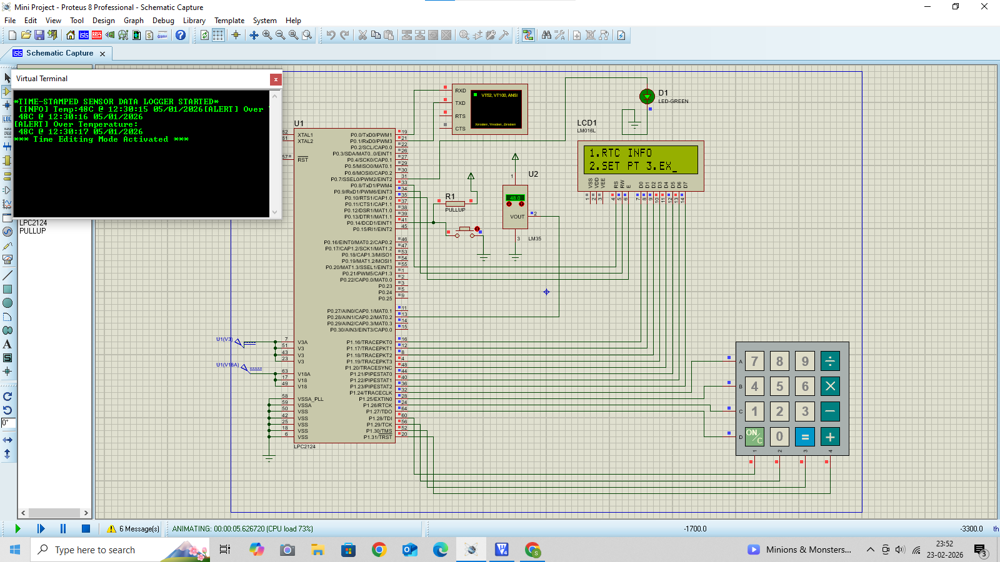
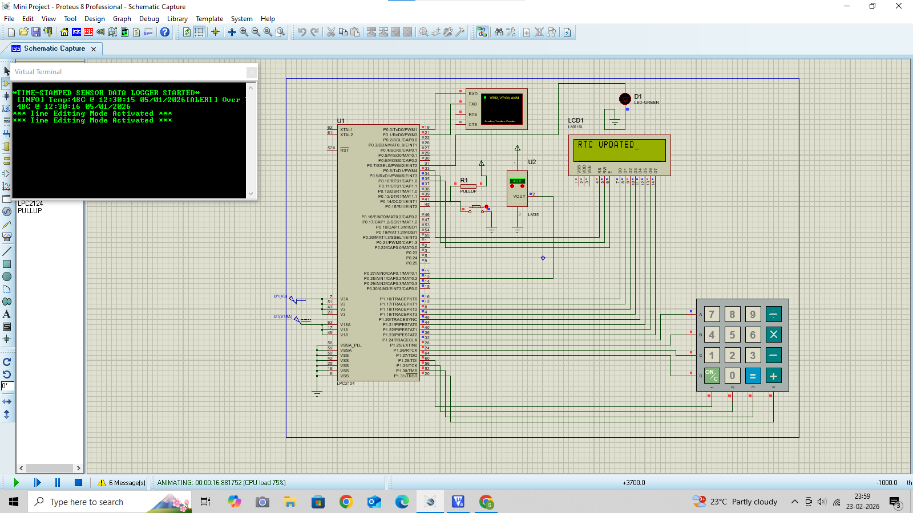

# 🚀 Project – Embedded System (LPC21xx)

## 📌 Project Title  
**Time-Stamped Sensor Monitoring & Alert System**

---

## 📖 Project Description  
This project is a complete **embedded system solution** developed using **Embedded C** on the **LPC21xx ARM microcontroller platform**.  
It is designed to monitor real-time sensor data, process it using ADC, attach time-stamps using RTC, display information on LCD, and generate alerts when predefined threshold conditions are crossed.

The system integrates multiple peripherals such as:
- Temperature sensor (**LM35**)
- Real-Time Clock (**RTC**)
- LCD display
- Keypad
- UART communication
- ADC module
- Alert system (LED/Buzzer)

This project demonstrates **real-time data acquisition, processing, user interaction, and alert generation**, making it suitable for:
- Academic mini-projects  
- Embedded system learning  
- Real-time monitoring applications  
- IoT foundation systems  

---

## 🎯 Objectives
- To design a real-time embedded monitoring system  
- To integrate multiple hardware peripherals  
- To implement modular driver-based architecture  
- To achieve time-stamped sensor data processing  
- To build an alert mechanism for critical conditions  

---

## 🧠 Key Features
- 🌡 Real-time temperature monitoring using LM35  
- ⏱ Time stamping using RTC  
- 📟 Live data display on LCD  
- 🔢 Analog data conversion using ADC  
- ⌨ User input through keypad  
- 🔔 Automatic alert generation system  
- 📡 UART communication support  
- 🧩 Modular code structure  
- 🕒 Real-time processing system  

---


---

## 🧰 Hardware Components
- LPC21xx ARM Microcontroller Board  
- LM35 Temperature Sensor  
- RTC Module  
- 16x2 LCD Display  
- Keypad  
- LED / Buzzer (Alert System)  
- USB-UART Converter  
- Power Supply Unit  

---

## 💻 Software Tools
- Keil µVision IDE  
- Flash Magic Programmer  
- Proteus (for simulation - optional)   

---

## ⚙ System Workflow
1. Sensor reads real-time temperature  
2. ADC converts analog signal to digital  
3. RTC adds real-time timestamp  
4. Data is processed by microcontroller  
5. Output is displayed on LCD  
6. User interaction via keypad  
7. Alert system activates if threshold exceeds  
8. Data communication via UART  

---

## 🎓 Academic Relevance  

This project demonstrates:

- ARM7 Embedded Programming  
- RTC, ADC, UART, LCD & Keypad Interfacing  
- Real-Time Data Logging  
- Firmware Modularity  

---

## 👩‍💻 Developed By  

**Sanskruti Manusmare**  
Embedded Systems | IoT | ARM Microcontrollers

## 📸 Hardware & Simulation Outputs  

The following results were captured during testing:

### 🔹 LCD Startup & Initial Logging  


---

### 🔹 Menu Interface Screen  


---

### 🔹 RTC Update Option Screen  



### 🔹 RTC Updated Dislay Screen  



### 🔹 Exiting Screen  


### 🔹 Alert Message on UART and LED ON 


---


### 📁 Project Structure  

```bash
Mini_Project/
│
├── mini_proj/
│   └── main.c
│
├── adc/
│   ├── adc.c
│   └── adc_defines.h
│
├── lm35/
│   ├── lm35.c
│   └── lm35.h
│
├── rtc/
│   ├── rtc.c
│   ├── rtc.h
│   └── rtc_defines.h
│
├── uart/
│   ├── uart.c
│   └── uart.h
│
├── lcd/
│   ├── lcd.c
│   └── lcd.h
│
├── keypad/
│   ├── keypad.c
│   └── keypad.h
│
├── display/
│   ├── display.c
│   └── display.h
│
├── edit/
│   ├── edit_mode.c
│   └── edit.h
│
├── alert_sys/
│   ├── alert.c
│   └── alert.h
│
├── defines/
│   └── defines.h
│
├── types/
│   └── types.h
│
└── README.md

